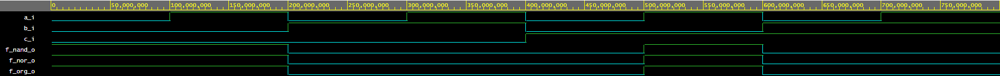
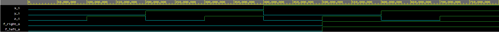

# Lab 1: Jiri Jilek

### De Morgan's laws

1. Equations of all three versions of logic function f(c,b,a):

   
   

2. Listing of VHDL architecture from design file (`code/design.vhd`) for all three functions.

```vhdl
architecture dataflow of gates is
begin
    f_org_o  <= (not(b_i) and a_i) or (not(c_i) and not(b_i));
    f_nand_o <= (not(b_i) nand (a_i)) nand (not(c_i) nand not(b_i)); -- Function modified acording to equation
    f_nor_o  <= not(((b_i) nor not(a_i)) nor ((c_i) nor (b_i)));  -- Function modified acording to equation
end architecture dataflow;

```

3. Table with logic functions' values:

| **c** | **b** |**a** | **f(c,b,a)_ORG** | **f(c,b,a)_NAND** | **f(c,b,a)_NOR** |
| :-: | :-: | :-: | :-: | :-: | :-: |
| 0 | 0 | 0 | 1 | 1 | 1 |
| 0 | 0 | 1 | 1 | 1 | 1 |
| 0 | 1 | 0 | 0 | 0 | 0 |
| 0 | 1 | 1 | 0 | 0 | 0 |
| 1 | 0 | 0 | 0 | 0 | 0 |
| 1 | 0 | 1 | 1 | 1 | 1 |
| 1 | 1 | 0 | 0 | 0 | 0 |
| 1 | 1 | 1 | 0 | 0 | 0 |

### Distributive laws

1. Screenshot with simulated time waveforms.
   - Original equation rewriten using only NAND and NOR
   
   (click to open picture in new tab)
   
   - Distributive law verification
   
   
   
   
   
   (click to open picture in new tab)
   ```vhdl
   architecture dataflow of gates is
   begin
         f_left_o  <= (x_i and y_i) or (x_i and z_i);
         f_right_o <= (x_i) and (y_i or z_i);
   end architecture dataflow;
   ```

2. Link to public EDA Playground example:

   [EDA Playgroud project - basic gates](https://www.edaplayground.com/x/vnvJ)
   [EDA Playgroud project - distributive laws](https://www.edaplayground.com/x/anrD)
