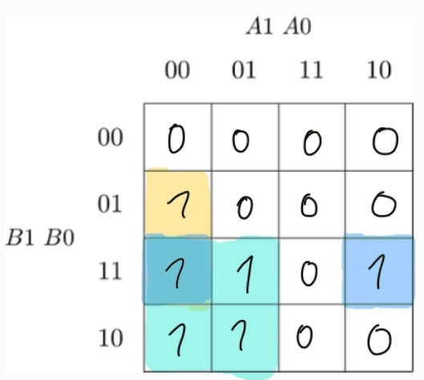
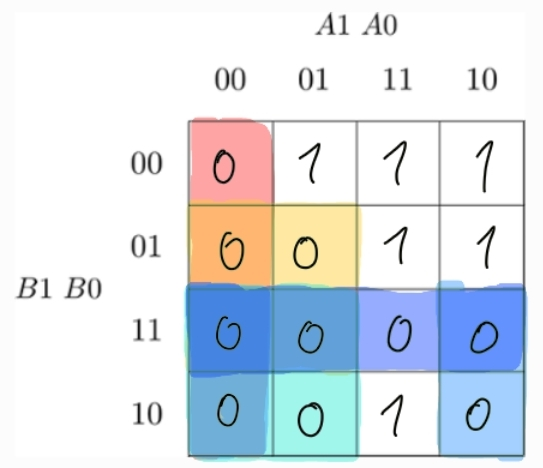
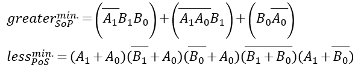
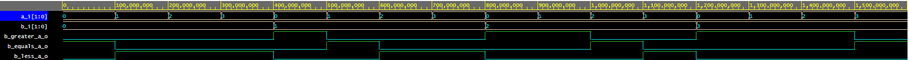
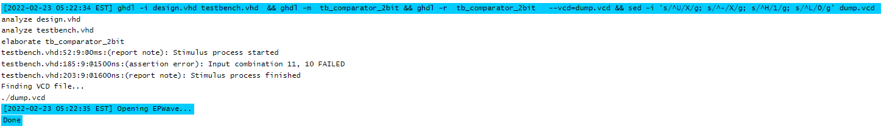
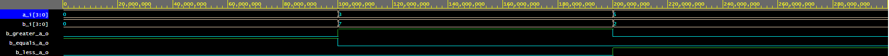
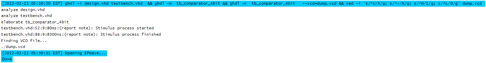
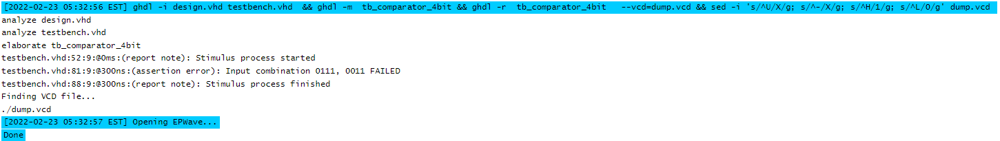

# Lab 2: Jiri Jilek

### 2-bit comparator

1. Truth table
   | **Dec. equivalent** | **B[1:0]** | **A[1:0]** | **B is greater than A** | **B equals A** | **B is less than A** |
   | :-: | :-: | :-: | :-: | :-: | :-: |
   |  0 | 0 0 | 0 0 | 0 | 1 | 0 |
   |  1 | 0 0 | 0 1 | 0 | 0 | 1 |
   |  2 | 0 0 | 1 0 | 0 | 0 | 1 |
   |  3 | 0 0 | 1 1 | 0 | 0 | 1 |
   |  4 | 0 1 | 0 0 | 1 | 0 | 0 |
   |  5 | 0 1 | 0 1 | 0 | 1 | 0 |
   |  6 | 0 1 | 1 0 | 0 | 0 | 1 |
   |  7 | 0 1 | 1 1 | 0 | 0 | 1 |
   |  8 | 1 0 | 0 0 | 1 | 0 | 0 |
   |  9 | 1 0 | 0 1 | 1 | 0 | 0 |
   | 10 | 1 0 | 1 0 | 0 | 1 | 0 |
   | 11 | 1 0 | 1 1 | 0 | 0 | 1 |
   | 12 | 1 1 | 0 0 | 1 | 0 | 0 |
   | 13 | 1 1 | 0 1 | 1 | 0 | 0 |
   | 14 | 1 1 | 1 0 | 1 | 0 | 0 |
   | 15 | 1 1 | 1 1 | 0 | 1 | 0 |

2. Karnaugh maps for other two functions:

   Greater than:

   

   Less than:

   

3. Equations of simplified SoP (Sum of the Products) form of the "greater than" function and simplified PoS (Product of the Sums) form of the "less than" function.

   

4. Binary comparator in VHDL language

   ```vhdl
    entity comparator_2bit is
    port(
        b_i           : in  std_logic_vector(2 - 1 downto 0);	--DATA B
        a_i           : in	std_logic_vector(2 - 1 downto 0);	--DATA A
        B_greater_A_o : out	std_logic;						--B is greater then A
        B_equals_A_o  : out	std_logic;						--B equals A
        B_less_A_o    : out std_logic  						--B is less than A
      );
   end entity comparator_2bit;

   ------------------------------------------------------------
   -- Architecture body for 2-bit binary comparator
   ------------------------------------------------------------
   architecture Behavioral of comparator_2bit is
   begin
      B_greater_A_o <= '1' when (b_i > a_i) else '0';
      B_equals_A_o  <= '1' when (b_i = a_i) else '0';
      B_less_A_o    <= '1' when (b_i < a_i) else '0';

   end architecture Behavioral;
   ```

5. Assertion statements in VHDL testbench

   ```vhdl
    p_stimulus : process
    begin
        -- Report a note at the beginning of stimulus process
        report "Stimulus process started" severity note;

        -- First test case ...
        s_b <= "00"; s_a <= "00"; wait for 100 ns;
        -- ... and its expected outputs
        assert ((s_B_greater_A = '0') and
                (s_B_equals_A  = '1') and
                (s_B_less_A    = '0'))
        -- If false, then report an error
        -- If true, then do not report anything
        report "Input combination 00, 00 FAILED" severity error;

		--Second test case
		s_b <= "00"; s_a <= "01"; wait for 100 ns;
        -- ... and its expected outputs
        assert ((s_B_greater_A = '0') and
                (s_B_equals_A  = '0') and
                (s_B_less_A    = '1'))
        -- If false, then report an error
        -- If true, then do not report anything
        report "Input combination 00, 01 FAILED" severity error;

        --Code is going all the way to the DEC 15

        -- Report a note at the end of stimulus process
        report "Stimulus process finished" severity note;
        wait; -- Data generation process is suspended forever

   end process p_stimulus;
   ```

6. Signals and log

   Signals of 2bit comparator:
   

   Log of 2bit comparator:
   

   Log of 2bit comparator with one intentional mistake:
   

6. Link to your public EDA Playground example:

   [https://www.edaplayground.com/x/v_9X](https://www.edaplayground.com/x/v_9X)

### 4-bit comparator

1. Listing of VHDL stimulus process from testbench file (`testbench.vhd`) with at least one assert (use BCD codes of your student ID digits as input combinations). Always use syntax highlighting, meaningful comments, and follow VHDL guidelines:

   Last two digits of my student ID: **73**
   
   | **Number** | **BCD code** |
   | :-: | :-: |
   |  7 | 0111 |
   |  3 | 0011 |

   ```vhdl
       p_stimulus : process
      begin
         -- Report a note at the beginning of stimulus process
         report "Stimulus process started" severity note;

         --Second test case
		  s_b <= "0111"; --last two digits of my ID - B si greater then A
         s_a <= "0011";
         wait for 100 ns;
         -- Expected output
         assert ((s_B_greater_A = '1') and
                (s_B_equals_A  = '0') and
                (s_B_less_A    = '0'))
        -- If false, then report an error
        report "Input combination 0111, 0011 FAILED" severity error;

        -- Report a note at the end of stimulus process
        report "Stimulus process finished" severity note;
        wait;
    end process p_stimulus;
   ```

2. Text console screenshot during your simulation, including reports.

   Signals of 4bit comparator:
   

   Log of 4bit comparator:
   

   Log of 4bit comparator with one intentional mistake:
   

3. Link to your public EDA Playground example:

   [https://www.edaplayground.com/x/Mn92](https://www.edaplayground.com/x/Mn92)